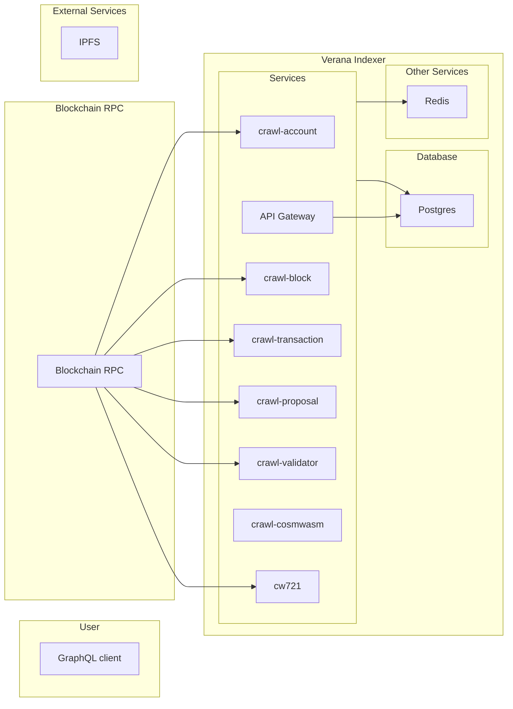

# Verana Indexer

The **Verana Indexer** is a specialized blockchain indexing service built on the [Horoscope V2](https://github.com/aura-nw/horoscope-v2/) framework, designed **exclusively** for the **Verana** decentralized trust ecosystem.

It not only indexes blocks, transactions, and accounts from Cosmos SDK-based blockchains, but also plays a **critical role** in the **Verifiable Trust** architecture by enabling **DID discovery**, **verifiable credential verification**, and **trust resolution** for services and agents on the Verana network.

## Purpose & Scope

While Horoscope V2 provides the base crawling and indexing capabilities, the Verana Indexer’s scope is broader:

- **Verana-Exclusive Integration** – Adapted to Verana’s governance, trust registries, and DID directory.
- **Real-Time DID Crawling & Updating** – Listens for DID-related blockchain events to keep an up-to-date registry of verifiable services (VS) and verifiable user agents (VUA).
- **Trust Resolution Support** – Integrates with the Trust Resolver to validate credentials and return concise Proof-of-Trust results.
- **Service Discovery** – Feeds the DID Directory for indexing verifiable services, enabling fast search for wallets, applications, and other services.
- **Off-chain Enriched Index** – Bridges minimal on-chain records with rich off-chain metadata for high-performance queries.

## Overview Architecture

Indexer consists of multiple services.
All services are small Node applications written in Typescript, built with [Moleculerjs](https://moleculer.services/) framework using [Moleculer TS base](https://github.com/aura-nw/moleculer-ts-base).
The crawler servires utilize [Bull](https://github.com/OptimalBits/bull) for efficient queue management of crawling jobs.

An overview of the architecture is shown below:



All services are stateless and can be scaled horizontally. Crawling jobs are queued in Redis and processed by the crawler services.
The current state of crawling jobs is stored in the database and can be queried via the GraphQL API.

## Services

A list of services is shown below:

- [**crawl-account**](./docs/services/crawl-account/crawl-account.md): get account auth and its balances
- [**crawl-block**](./docs/services/crawl-block/crawl-block.md): get block from network and insert to DB
- [**crawl-transaction**](./docs/services/crawl-transaction/crawl-tx.md): get transaction in a block and decode to readable
- [**crawl-proposal**](./docs/services/crawl-proposal/crawl-proposal.md): get proposal and its status
- [**crawl-validator**](./docs/services/crawl-validator/crawl-validator.md): get validator and their power event, signing info
- [**crawl-genesis**](./docs/services/crawl-genesis/crawl-genesis.md): get state from genesis chunk
- [**crawl-dids**](./docs/services/crawl-did/crawl-did.md): Crawl and updates DIDs in real time by listening to blockchain events.
- [**crawl-tr**](./docs/services/crawl-tr/crawl-tr.md): Crawl Trust Registry, governance frameworks, and track version changes.
- [**crawl-cs**](./docs/services/crawl-cs//crawl-cs.md): Crawl all credential schema–related transactions and update their state in the database.
- [**crawl-perm**](./docs/services/crawl-perm/crawl-perm.md): Crawl all permissions related to Trust Registry and Credential Schema transactions, and synchronize their current state in the database.
- [**crawl-td**](./docs/services/crawl-td/crawl-td.md):This service is responsible for crawling and indexing all Trust Deposit states in the database to keep the data up to date.
- [**crawl-ar**](./docs/services/crawl-ar/crawl-ar.md): Crawl all blockchain accounts, get their Account Reputation, and save it to the DB.
- [**handle-vote**](./docs/services/handle-vote/handle-vote.md): parse vote message

## Database schema

You can view detail database schema [here](./docs/database_schema.md)

## Setup

### 1) Install dependencies

```bash
pnpm i
```

### 2) Create your environment file

```bash
cp .env.example .env
# then open .env and fill in the required values
```

### 3) Start infrastructure (PostgreSQL, Redis)

```bash
pnpm run docker
```

This will start the PostgreSQL, Redis containers in the background.

> **Note:** Make sure the required ports aren’t already in use on your machine.

## Configuration

[Config Moleculer](.env.example), refer [docs](https://moleculer.services/docs/0.14/configuration.html) to get detail configurations.
[Config chain](config.json) to setup crawling jobs and the crawling chain information.

## Adding a new chain

Setting up Verana Indexer for a new chain is straight-forward:

- Configure the crawling jobs and chain information in the `config.json` file
- If the chain has custom messages, you may need to add a new message decoder (see [Message Decoders](#message-decoders) section).
- Start crawling your chain :fireworks:
