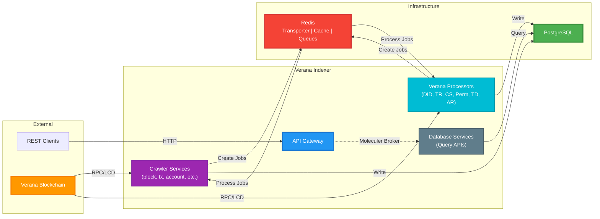

# Verana Indexer

The **Verana Indexer** is a specialized blockchain indexing service built on the [Horoscope V2](https://github.com/aura-nw/horoscope-v2/) framework, designed **exclusively** for the **Verana** decentralized trust ecosystem.

It not only indexes blocks, transactions, and accounts from Cosmos SDK-based blockchains, but also plays a **critical role** in the **Verifiable Trust** architecture by enabling **DID discovery**, **verifiable credential verification**, and **trust resolution** for services and agents on the Verana network.

## Purpose & Scope

While Horoscope V2 provides the base crawling and indexing capabilities, the Verana Indexer’s scope is broader:

- **Verana-Exclusive Integration** – Adapted to Verana’s governance, trust registries, and DID directory.
- **Real-Time DID Crawling & Updating** – Listens for DID-related blockchain events to keep an up-to-date registry of verifiable services (VS) and verifiable user agents (VUA).
- **Trust Resolution Support** – Integrates with the Trust Resolver to validate credentials and return concise Proof-of-Trust results.
- **Service Discovery** – Feeds the DID Directory for indexing verifiable services, enabling fast search for wallets, applications, and other services.
- **Off-chain Enriched Index** – Bridges minimal on-chain records with rich off-chain metadata for high-performance queries.

## Overview Architecture

Indexer consists of multiple services.
All services are small Node applications written in Typescript, built with [Moleculerjs](https://moleculer.services/) framework using [Moleculer TS base](https://github.com/aura-nw/moleculer-ts-base).
The crawler servires utilize [Bull](https://github.com/OptimalBits/bull) for efficient queue management of crawling jobs.

An overview of the architecture is shown below:



**Architecture Overview:**

All services are **Moleculer microservices** that communicate via the **Moleculer broker** (using Redis as transporter). The system operates in two main flows:

1. **Crawling Flow**: Crawler services fetch data from the blockchain, create jobs in Redis queues, and workers process these jobs to write indexed data to PostgreSQL.

2. **API Flow**: REST clients call the API Gateway, which routes requests to database services via the Moleculer broker. Database services query PostgreSQL and return results.

**Redis serves three purposes:**
- **Transporter**: Enables Moleculer service-to-service communication
- **Cache**: Provides caching layer for frequently accessed data
- **Job Queues**: Stores and manages crawling jobs using Bull/BullMQ

All services are stateless and can be scaled horizontally.

## Services

A list of services is shown below:

- [**crawl-account**](./docs/services/crawl-account/crawl-account.md): get account auth and its balances
- [**crawl-block**](./docs/services/crawl-block/crawl-block.md): get block from network and insert to DB
- [**crawl-transaction**](./docs/services/crawl-transaction/crawl-tx.md): get transaction in a block and decode to readable
- [**crawl-proposal**](./docs/services/crawl-proposal/crawl-proposal.md): get proposal and its status
- [**crawl-validator**](./docs/services/crawl-validator/crawl-validator.md): get validator and their power event, signing info
- [**crawl-genesis**](./docs/services/crawl-genesis/crawl-genesis.md): get state from genesis chunk
- [**crawl-dids**](./docs/services/crawl-did/crawl-did.md): Crawl and updates DIDs in real time by listening to blockchain events.
- [**crawl-tr**](./docs/services/crawl-tr/crawl-tr.md): Crawl Trust Registry, governance frameworks, and track version changes.
- [**crawl-cs**](./docs/services/crawl-cs//crawl-cs.md): Crawl all credential schema–related transactions and update their state in the database.
- [**crawl-perm**](./docs/services/crawl-perm/crawl-perm.md): Crawl all permissions related to Trust Registry and Credential Schema transactions, and synchronize their current state in the database.
- [**crawl-td**](./docs/services/crawl-td/crawl-td.md):This service is responsible for crawling and indexing all Trust Deposit states in the database to keep the data up to date.
- [**crawl-ar**](./docs/services/crawl-ar/crawl-ar.md): Crawl all blockchain accounts, get their Account Reputation, and save it to the DB.
- [**handle-vote**](./docs/services/handle-vote/handle-vote.md): parse vote message

## Database schema

You can view detail database schema [here](./docs/database_schema.md)

## Setup

This setup guide is for **local development** and connecting to the **Verana testnet**. For production deployments or other networks, adjust the configuration accordingly.

### 1) Install dependencies

```bash
pnpm i
```

### 2) Create your environment file

```bash
cp .env.example .env
# then open .env and fill in the required values
```

### 3) Start infrastructure (PostgreSQL, Redis)

```bash
pnpm run docker:dev
```

This will start the PostgreSQL and Redis containers in the background.

> **Note:** Make sure the required ports aren't already in use on your machine.

## Configuration

### Environment Variables

The application is configured through environment variables. See `.env.example` for a complete list.

#### Mandatory Environment Variables

These must be configured for the indexer to function:

**Network Configuration:**
- `CHAIN_ID` - The Verana chain ID (e.g., `vna-testnet-1`)
- `RPC_ENDPOINT` - Blockchain RPC endpoint URL (e.g., `https://rpc.testnet.verana.network/`)
- `LCD_ENDPOINT` - Blockchain LCD/REST API endpoint URL (e.g., `https://api.testnet.verana.network`)

**Database Configuration:**
- `POSTGRES_HOST` - PostgreSQL host address
- `POSTGRES_PORT` - PostgreSQL port (default: `5432`)
- `POSTGRES_USER` - PostgreSQL username
- `POSTGRES_PASSWORD` - PostgreSQL password
- `POSTGRES_DB` - PostgreSQL database name

**Redis Configuration:**
- `TRANSPORTER` - Redis connection string for Moleculer transporter (e.g., `redis://127.0.0.1:6379`)
- `CACHER` - Redis connection string for caching (e.g., `redis://127.0.0.1:6379`)
- `QUEUE_JOB_REDIS` - Redis connection string for job queues (e.g., `redis://127.0.0.1:6379`)

#### Important Optional Variables

These have sensible defaults but may need adjustment for specific deployments:

- `MOLECULER_NAMESPACE` - Namespace for service isolation (default: `verana-indexer`)
- `REDIS_DB_NUMBER` - Redis database number (default: `20`)
- `PORT` - API Gateway port (default: `3001`)
- `LOGLEVEL` - Logging level (default: `info`)
- `NODE_ENV` - Environment mode: `development` or `production`

#### Advanced Configuration

Beyond the required variables, the indexer lets you fine‑tune most runtime behaviors through environment variables (see `.env.example`). The most commonly used groups are listed below.

**Service bootstrap & migrations**
- `SERVICEDIR` / `SERVICES` – Control which compiled service files Moleculer loads (`dist/src/services/**/*.service.js` in production, `src/services/**/*.service.ts` in development).
- `MIGRATION_MODE` – Set to `lightweight` to force knex to use minimal pool sizes and longer acquire timeouts. The `src/scripts/migrate-if-needed.ts` script enforces this automatically so migrations can succeed on slow startup storage.

**Extra network context**
- `EVM_JSON_RPC` / `EVM_CHAIN_ID` – Optional EVM endpoint and chain ID that some services use when they need an EVM-compatible RPC.
- `REDIS_DB_NUMBER` – Alternate Redis logical database when you need to isolate queues/caches.
- `MOLECULER_NAMESPACE` – Overrides the default service namespace so multiple indexers can share the same Redis.

**Database tuning**
- `POSTGRES_POOL_MAX` – Upper bound for knex pool size. Increase for higher concurrency, decrease to protect light instances.
- `POSTGRES_STATEMENT_TIMEOUT` – Milliseconds before PostgreSQL cancels long-running statements.
- `POSTGRES_CONNECTION_TIMEOUT` – Overrides the connection wait timeout (defaults to 60s unless `MIGRATION_MODE=lightweight` bumps it to 120s).
- `POSTGRES_DB_TEST` – Separate database name used when `NODE_ENV=test`.

**Moleculer runtime**
- `TRANSPORTER`, `CACHER`, `QUEUE_JOB_REDIS` – Independent Redis connection strings for service bus, cache, and Bull/BullMQ queues.
- `SERIALIZER`, `LOGLEVEL`, `NAMESPACE`, `NODEID`, `DEFAULT_PREFIX` – Standard Moleculer knobs for serialization format, log verbosity, logical namespace, node ID prefix, and queue prefixes.
- `REQUEST_TIMEOUT`, `RETRYPOLICY`, `RETRIES`, `RETRYDELAY`, `RETRYMAXDELAY`, `RETRYFACTOR`, `MAXCALLLEVEL` – Configure broker call behavior and retry policies.
- `HEARTBEATINTERVAL`, `HEARTBEATTIMEOUT`, `CTXPARAMSCLONING`, `TRACKING_ENABLED`, `TRACKINGSHUTDOWNTIME`, `BALANCER_ENABLED`, `STRATEGY`, `PREFERLOCAL` – Fine-grained cluster controls (heartbeat cadence, context cloning, request tracking, load-balancer preferences).

**Resiliency limits**
- `BREAKER_ENABLED`, `BREAKERTHRESHOLD`, `BREAKERMINREQCOUNT`, `WINDOWTIME`, `HALFOPENTIME` – Circuit breaker thresholds for unstable dependencies.
- `BULKHEAD_ENABLED`, `CONCURRENCY`, `MAXQUEUESIZE` – Bulkhead configuration that caps concurrent calls per action.
- `RATE_LIMIT`, `RATE_LIMIT_WINDOW` – Moleculer rate limiter caps per action.

**Observability**
- `LOGGERTYPE`, `LOGGERCOLORS`, `LOGGERMODULECOLORS`, `LOGGERFORMATTER`, `LOGGERAUTOPADDING` – Fine grain logger output formatting.
- `METRICS_ENABLED`, `METRICS_TYPE`, `METRICS_PORT`, `METRICS_PATH` – Control Prometheus/Console metrics exposure.
- `TRACING_ENABLED`, `TRACING_TYPE`, `TRACING_ZIPKIN_URL`, `TRACING_COLORS`, `TRACING_WIDTH`, `TRACING_GUAGEWIDTH` – Trace exporters (Console/Zipkin) and formatting.

**Content gateways**
- `IPFS_GATEWAY`, `REQUEST_IPFS_TIMEOUT`, `MAX_CONTENT_LENGTH_BYTE`, `MAX_BODY_LENGTH_BYTE`, `S3_GATEWAY` – Timeouts and size caps used when fetching off-chain artifacts from IPFS/S3 during DID or credential syncing.

**Miscellaneous**
- `ADD_INTER_NAMESPACE_MIDDLEWARE`, `VALIDATOR_ENABLED` – Feature flags for cross-namespace middleware and validator logic.

Refer to the [Moleculer configuration reference](https://moleculer.services/docs/0.14/configuration.html) if you need to drill into any of these settings.

### Chain Configuration (`config.json`)

The `src/config.json` file contains chain-specific and job-specific configuration:

**Chain Information:**
- `chainName` - Chain identifier
- `networkPrefixAddress`, `consensusPrefixAddress`, `validatorPrefixAddress` - Address prefixes
- `networkDenom` - Native denomination (e.g., `uvna`)

**Crawling Job Configuration:**
Each service has its own configuration section (e.g., `crawlBlock`, `crawlTransaction`, `crawlDids`, etc.) that controls:
- Crawling intervals and timing
- Batch sizes and chunk sizes
- Retry policies
- Start blocks for initial sync

**What to modify for different deployments:**
- Chain-specific settings (prefixes, denomination) if deploying to a different Verana network variant
- Crawling job intervals and batch sizes based on network performance and requirements
- Start blocks if you need to reindex from a specific block height

For most Verana deployments, the default configuration should work without modification.

## Deployment Configuration

The Verana Indexer is designed specifically for the Verana blockchain. For different Verana network deployments (e.g., testnet vs mainnet), you typically only need to adjust:

1. **Environment Variables** - Update network endpoints (`RPC_ENDPOINT`, `LCD_ENDPOINT`, `CHAIN_ID`) and database credentials
2. **Chain Settings in `config.json`** - If the network uses different address prefixes or denomination, update:
   - `networkPrefixAddress`
   - `consensusPrefixAddress`
   - `validatorPrefixAddress`
   - `networkDenom`

The crawling job configurations in `config.json` (intervals, batch sizes, etc.) are usually fine with defaults, but can be tuned based on network performance requirements.
