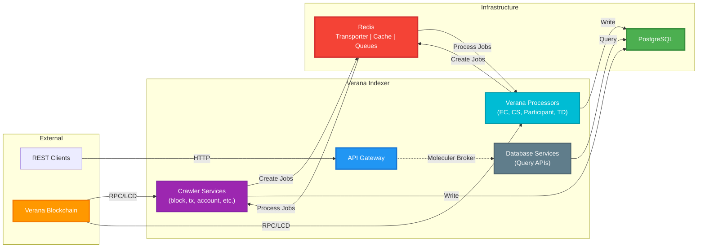

# Verana Indexer

The **Verana Indexer** is a specialized blockchain indexing service built on the [Horoscope V2](https://github.com/aura-nw/horoscope-v2/) framework, designed **exclusively** for the **Verana** decentralized trust ecosystem.

It not only indexes blocks, transactions, and accounts from Cosmos SDK-based blockchains, but also plays a **critical role** in the **Verifiable Trust** architecture by enabling **verifiable credential verification** and **trust resolution** for services and agents on the Verana network.

## Purpose & Scope

While Horoscope V2 provides the base crawling and indexing capabilities, the Verana Indexer’s scope is broader:

- **Verana-Exclusive Integration** – Adapted to Verana’s governance, ecosystems, credential schemas, and participants.
- **Trust Resolution Support** – Integrates with the Trust Resolver to validate credentials and return concise Proof-of-Trust results.
- **Indexed trust state** – Exposes ecosystems, schemas, participants, and deposits via HTTP APIs for wallets and applications.
- **Off-chain Enriched Index** – Bridges minimal on-chain records with rich off-chain metadata for high-performance queries.

## Overview Architecture

Indexer consists of multiple services.
All services are small Node applications written in Typescript, built with [Moleculerjs](https://moleculer.services/) framework using [Moleculer TS base](https://github.com/aura-nw/moleculer-ts-base).
The crawler servires utilize [Bull](https://github.com/OptimalBits/bull) for efficient queue management of crawling jobs.

An overview of the architecture is shown below:


```mermaid
flowchart LR
    subgraph EXT["External"]
        CLIENTS["REST Clients"]
        BLOCKCHAIN["Verana Blockchain"]
    end

    subgraph INDEXER["Verana Indexer"]
        API["API Gateway"]
        CRAWLERS["Crawler Services<br/>(block, tx, account, etc.)"]
        PROCESSORS["Verana Processors<br/>(EC, CS, Participant, TD)"]
        DB_SERVICES["Database Services<br/>(Query APIs)"]
    end

    subgraph INFRA["Infrastructure"]
        REDIS["Redis<br/>Transporter | Cache | Queues"]
        POSTGRES["PostgreSQL"]
    end

    CLIENTS -->|HTTP| API
    BLOCKCHAIN -->|RPC/LCD| CRAWLERS
    BLOCKCHAIN -->|RPC/LCD| PROCESSORS
    
    API -.->|Moleculer Broker| DB_SERVICES
    DB_SERVICES -->|Query| POSTGRES
    
    CRAWLERS -->|Create Jobs| REDIS
    PROCESSORS -->|Create Jobs| REDIS
    REDIS -->|Process Jobs| CRAWLERS
    REDIS -->|Process Jobs| PROCESSORS
    
    CRAWLERS -->|Write| POSTGRES
    PROCESSORS -->|Write| POSTGRES

    style API fill:#2196F3,stroke:#1976D2,stroke-width:3px,color:#fff
    style POSTGRES fill:#4CAF50,stroke:#388E3C,stroke-width:3px,color:#fff
    style REDIS fill:#F44336,stroke:#D32F2F,stroke-width:3px,color:#fff
    style BLOCKCHAIN fill:#FF9800,stroke:#F57C00,stroke-width:3px,color:#fff
    style CRAWLERS fill:#9C27B0,stroke:#7B1FA2,stroke-width:2px,color:#fff
    style PROCESSORS fill:#00BCD4,stroke:#0097A7,stroke-width:2px,color:#fff
    style DB_SERVICES fill:#607D8B,stroke:#455A64,stroke-width:2px,color:#fff
```

**Architecture Overview:**

All services are **Moleculer microservices** that communicate via the **Moleculer broker** (using Redis as transporter). The system operates in two main flows:

1. **Crawling Flow**: Crawler services fetch data from the blockchain, create jobs in Redis queues, and workers process these jobs to write indexed data to PostgreSQL.

2. **API Flow**: REST clients call the API Gateway, which routes requests to database services via the Moleculer broker. Database services query PostgreSQL and return results.

**Redis serves three purposes:**
- **Transporter**: Enables Moleculer service-to-service communication
- **Cache**: Provides caching layer for frequently accessed data
- **Job Queues**: Stores and manages crawling jobs using Bull/BullMQ

All services are stateless and can be scaled horizontally.

## Services

A list of services is shown below:

- [**crawl-account**](./docs/services/crawl-account/crawl-account.md): get account auth and its balances
- [**crawl-block**](./docs/services/crawl-block/crawl-block.md): get block from network and insert to DB
- [**crawl-transaction**](./docs/services/crawl-transaction/crawl-tx.md): get transaction in a block and decode to readable
- [**crawl-proposal**](./docs/services/crawl-proposal/crawl-proposal.md): get proposal and its status
- [**crawl-validator**](./docs/services/crawl-validator/crawl-validator.md): get validator and their power event, signing info
- [**crawl-genesis**](./docs/services/crawl-genesis/crawl-genesis.md): get state from genesis chunk
- [**crawl-ec**](./docs/services/crawl-ec/crawl-ec.md): Crawl Ecosystem, governance frameworks, and track version changes.
- [**crawl-cs**](./docs/services/crawl-cs//crawl-cs.md): Crawl all credential schema–related transactions and update their state in the database.
- [**crawl-cs height-sync refactor**](./docs/services/crawl-cs/cs-height-sync.md): Height-based Credential Schema synchronization path (ledger-backed CS sync).
- [**crawl-pp**](./docs/services/crawl-pp/crawl-pp.md): Crawl all participants related to Ecosystem and Credential Schema transactions, and synchronize their current state in the database.
- [**crawl-pp height-sync refactor**](./docs/services/crawl-pp/crawl-pp.md#participant-height-sync-refactor): Height-based Participant synchronization path (ledger-backed Participant sync with runtime verification).
- [**crawl-td**](./docs/services/crawl-td/crawl-td.md):This service is responsible for crawling and indexing all Trust Deposit states in the database to keep the data up to date.
- [**handle-vote**](./docs/services/handle-vote/handle-vote.md): parse vote message

## Database schema

You can view detail database schema [here](./docs/database_schema.md)

## Setup

This setup guide is for **local development** and connecting to the **Verana testnet**. For production deployments or other networks, adjust the configuration accordingly.

### 1) Install dependencies

```bash
pnpm i
```

### 2) Create your environment file

```bash
cp .env.example .env
# then open .env and fill in the required values
```

### 3) Start infrastructure (PostgreSQL, Redis)

```bash
pnpm run docker:dev
```

This will start the PostgreSQL and Redis containers in the background.

> **Note:** Make sure the required ports aren't already in use on your machine.

## Testing

```bash
pnpm run test:local
```

This is the recommended way to run the test suite locally. The script
([scripts/test-local.sh](scripts/test-local.sh)) spins up an ephemeral PostgreSQL container on port
`5433`, runs migrations, executes the suite (same as CI), and removes the container when it finishes —
so it never touches your dev database. It was added because the plain `pnpm run test` / `pnpm run test-ci`
commands expect a pre-existing, migrated test database (which CI provides as a service) and otherwise
hang on connection timeouts.

## Configuration

### Environment Variables

The application is configured through environment variables. See `.env.example` for a complete list.

#### Mandatory Environment Variables

These must be configured for the indexer to function:

**Network Configuration:**
- `CHAIN_ID` - The Verana chain ID (e.g., `vna-testnet-1`)
- `RPC_ENDPOINT` - Blockchain RPC endpoint URL (e.g., `https://rpc.testnet.verana.network/`)
- `LCD_ENDPOINT` - Blockchain LCD/REST API endpoint URL (e.g., `https://api.testnet.verana.network`)

**Database Configuration:**
- `POSTGRES_HOST` - PostgreSQL host address
- `POSTGRES_PORT` - PostgreSQL port (default: `5432`)
- `POSTGRES_USER` - PostgreSQL username
- `POSTGRES_PASSWORD` - PostgreSQL password
- `POSTGRES_DB` - PostgreSQL database name

**Redis Configuration:**
- `TRANSPORTER` - Redis connection string for Moleculer transporter (e.g., `redis://127.0.0.1:6379`)
- `CACHER` - Redis connection string for caching (e.g., `redis://127.0.0.1:6379`)
- `QUEUE_JOB_REDIS` - Redis connection string for job queues (e.g., `redis://127.0.0.1:6379`)

#### Important Optional Variables

These have sensible defaults but may need adjustment for specific deployments:

- `MOLECULER_NAMESPACE` - Namespace for service isolation (default: `verana-indexer`)
- `REDIS_DB_NUMBER` - Redis database number (default: `20`)
- `PORT` - API Gateway port (default: `3001`)
- `LOGLEVEL` - Logging level (default: `info`)
- `NODE_ENV` - Environment mode: `development` or `production`
- `SKIP_UNKNOWN_MESSAGES` - Set to `true` to allow indexer to continue processing unknown message types (test/debug mode only)

#### Advanced Configuration

Beyond the required variables, the indexer lets you fine‑tune most runtime behaviors through environment variables (see `.env.example`). The most commonly used groups are listed below.

**Service bootstrap & migrations**
- `SERVICEDIR` / `SERVICES` – Control which compiled service files Moleculer loads (`dist/src/services/**/*.service.js` in production, `src/services/**/*.service.ts` in development).
- `MIGRATION_MODE` – Set to `lightweight` to force knex to use minimal pool sizes and longer acquire timeouts. The `src/scripts/migrate-if-needed.ts` script enforces this automatically so migrations can succeed on slow startup storage.

**Extra network context**
- `EVM_JSON_RPC` / `EVM_CHAIN_ID` – Optional EVM endpoint and chain ID that some services use when they need an EVM-compatible RPC.
- `REDIS_DB_NUMBER` – Alternate Redis logical database when you need to isolate queues/caches.
- `MOLECULER_NAMESPACE` – Overrides the default service namespace so multiple indexers can share the same Redis.

**Safety & Validation**
- `SKIP_UNKNOWN_MESSAGES` – Set to `true` to disable indexer stopping on unknown message types (use only for testing/debugging)

**Database tuning**
- `POSTGRES_POOL_MAX` – Upper bound for knex pool size. Increase for higher concurrency, decrease to protect light instances.
- `POSTGRES_STATEMENT_TIMEOUT` – Milliseconds before PostgreSQL cancels long-running statements.
- `POSTGRES_QUERY_TIMEOUT` / `DB_QUERY_TIMEOUT_MS` – Query timeout controls used by knex/helpers (`DB_QUERY_TIMEOUT_MS` takes precedence in helper logic).
- `POSTGRES_CONNECTION_TIMEOUT` – Overrides the connection wait timeout (defaults to 60s unless `MIGRATION_MODE=lightweight` bumps it to 120s).
- `POSTGRES_POOL_ACQUIRE_TIMEOUT`, `POSTGRES_POOL_CREATE_TIMEOUT`, `POSTGRES_POOL_DESTROY_TIMEOUT` – Knex/tarn pool timeout tuning.
- `POSTGRES_DB_TEST` – Separate database name used when `NODE_ENV=test`.

**Moleculer runtime**
- `TRANSPORTER`, `CACHER`, `QUEUE_JOB_REDIS` – Independent Redis connection strings for service bus, cache, and Bull/BullMQ queues.
- `SERIALIZER`, `LOGLEVEL`, `NAMESPACE`, `NODEID`, `DEFAULT_PREFIX` – Standard Moleculer knobs for serialization format, log verbosity, logical namespace, node ID prefix, and queue prefixes.
- `REQUEST_TIMEOUT`, `RETRYPOLICY`, `RETRIES`, `RETRYDELAY`, `RETRYMAXDELAY`, `RETRYFACTOR`, `MAXCALLLEVEL` – Configure broker call behavior and retry policies.
- `HEARTBEATINTERVAL`, `HEARTBEATTIMEOUT`, `CTXPARAMSCLONING`, `TRACKING_ENABLED`, `TRACKINGSHUTDOWNTIME`, `BALANCER_ENABLED`, `STRATEGY`, `PREFERLOCAL` – Fine-grained cluster controls (heartbeat cadence, context cloning, request tracking, load-balancer preferences).

**Resiliency limits**
- `BREAKER_ENABLED`, `BREAKERTHRESHOLD`, `BREAKERMINREQCOUNT`, `WINDOWTIME`, `HALFOPENTIME` – Circuit breaker thresholds for unstable dependencies.
- `BULKHEAD_ENABLED`, `CONCURRENCY`, `MAXQUEUESIZE` – Bulkhead configuration that caps concurrent calls per action.
- `RATE_LIMIT`, `RATE_LIMIT_WINDOW` – Moleculer rate limiter caps per action.

**Observability**
- `LOGGERTYPE`, `LOGGERCOLORS`, `LOGGERMODULECOLORS`, `LOGGERFORMATTER`, `LOGGERAUTOPADDING` – Fine grain logger output formatting.
- `METRICS_ENABLED`, `METRICS_TYPE`, `METRICS_PORT`, `METRICS_PATH` – Control Prometheus/Console metrics exposure.
- `TRACING_ENABLED`, `TRACING_TYPE`, `TRACING_ZIPKIN_URL`, `TRACING_COLORS`, `TRACING_WIDTH`, `TRACING_GUAGEWIDTH` – Trace exporters (Console/Zipkin) and formatting.

**Height Sync Mode (CS & Ecosystem)**
- `USE_HEIGHT_SYNC_CS` – Set to `true` (recommended/default in `.env.example`) to enable ledger-backed Credential Schema (CS) synchronization by block height. When `false`, the indexer uses the legacy CS message-processor path.
- `USE_HEIGHT_SYNC_TR` – Set to `true` to enable the Ecosystem (EC) height-sync reconciliation path. When `true`, EC message handlers will reconcile their state against the authoritative ledger `/verana/ec/v1/get/{id}` response at the processed block height and then compute indexer-only aggregates (participants, stats, ecosystem/network counters). When `false` or unset, the indexer uses the legacy EC message-processor logic only.
- See `docs/services/crawl-cs/cs-height-sync.md` for the CS flow, routing, and verification logs. A corresponding EC height-sync document can be added under `docs/services/crawl-ec/` following the same structure.

**Participant (PP) Height-Sync Refactor**
- `USE_HEIGHT_SYNC_PARTICIPANT` – Set to `true` (recommended/default in `.env.example`) to enable ledger-backed Participant synchronization by block height. When `false`, the indexer uses the legacy message-by-message Participant processor path.
- Runtime verification is enabled in this mode:
  - immediate compare at processed block height
  - rolling multi-height verification window (3 heights)
- See `docs/services/crawl-pp/crawl-pp.md` for flow and verification details.

**Trust Deposit (TD) Height-Sync Refactor**
- `USE_HEIGHT_SYNC_TD` – Set to `true` (recommended/default in `.env.example`) to enable ledger-backed Trust Deposit synchronization by block height (GET `/verana/td/v1/get/{id}` with `x-cosmos-block-height`). When unset or `false`, the indexer uses the legacy event/message processor path.
- See `docs/services/crawl-td/td-height-sync.md` for flow, supported messages, and module layout.

**Content gateways**
- `IPFS_GATEWAY`, `REQUEST_IPFS_TIMEOUT`, `MAX_CONTENT_LENGTH_BYTE`, `MAX_BODY_LENGTH_BYTE`, `S3_GATEWAY` – Timeouts and size caps used when fetching off-chain artifacts from IPFS/S3 during DID or credential syncing.

**Miscellaneous**
- `ADD_INTER_NAMESPACE_MIDDLEWARE`, `VALIDATOR_ENABLED` – Feature flags for cross-namespace middleware and validator logic.
- `DB_STORAGE_MAX_MB`, `NODE_MEMORY_CRITICAL_MB`, `NODE_MEMORY_RESUME_MB` – Health guard thresholds for DB growth and crawler memory pressure.

Refer to the [Moleculer configuration reference](https://moleculer.services/docs/0.14/configuration.html) if you need to drill into any of these settings.

### Crawl Performance Optimization

Recent crawler tuning introduced a **bounded, multiplier-based speed scaling layer** to improve reindex throughput without changing crawler architecture or removing memory protections.

This refactor was required because static crawl timings and conservative batch/concurrency defaults made reindexing slower than necessary on healthy systems, while fully unbounded scaling would create instability (DB pressure, RPC saturation, heap spikes).

#### Design Goals

- Make **reindex mode** materially faster than the previous defaults
- Keep **fresh mode** conservative and stable
- Preserve memory safety for a **4GB Node.js heap**
- Prevent runaway scaling (no unbounded multipliers, no infinite math)
- Keep behavior predictable under load by using hard caps

#### Multiplier-Based Scaling (Bounded)

Crawler speed helpers now scale three dimensions using a mode-aware multiplier:

- **Delay** (`applySpeedToDelay`) -> lower delay as multiplier increases
- **Batch size** (`applySpeedToBatchSize`) -> larger batches as multiplier increases
- **Concurrency** (`getRecommendedConcurrency`) -> more parallel workers/chunks where supported

Scaling is intentionally **bounded**:

- Inputs are sanitized (invalid/non-finite values fall back to safe defaults)
- Results are clamped with mode-specific caps
- Reindex uses a direct scaling path (`base / multiplier`, `base * multiplier`) with bounded limits

This keeps tuning aggressive enough for reindexing while avoiding unstable configurations such as accidental `1000x` amplification.

#### Fresh vs Reindex Modes

**Fresh mode (initial/live-safe mode)**
- Prioritizes stability and predictable load
- Uses a conservative effective multiplier cap (currently `10x`)
- Keeps existing service behavior and pacing intentionally conservative

**Reindex mode (historical catch-up/rebuild mode)**
- Uses a more aggressive direct-scaling multiplier path
- Applies higher caps for delay reduction, batch size, and concurrency
- Still respects memory guards and health-based throttling when the system is degraded/critical

#### Effective Caps (Current Defaults)

**Fresh mode caps**
- Effective multiplier cap: `10`
- Max batch size: `600`
- Max concurrency: `40`
- Minimum delay: `5ms`

**Reindex mode caps**
- Effective multiplier cap: `80`
- Max batch size: `1000`
- Max concurrency: `60`
- Minimum delay: `1ms`

These are **hard caps** in the helper layer and are used to prevent runaway scheduling and memory pressure.

#### Delay Reduction Logic

Delay is reduced using bounded division:

- `adjustedDelay = floor(baseDelay / effectiveMultiplier)`
- Then clamped to a mode-specific minimum (`5ms` fresh, `1ms` reindex`)

This keeps reindex behavior close to a simple aggressive model while preventing zero/negative scheduling intervals.

#### Memory Safety (4GB Heap Safe)

The optimization is designed to remain **bounded** and work with existing safety controls for a **4GB-class heap**:

- Hard caps for concurrency and batch size
- Existing heap/memory guards in crawler loops
- Health-based throttling when system health is `degraded` or `critical`
- No architectural changes such as `worker_threads`
- No full-dataset `Promise.all(...)` introduced by the refactor

In practice, reindex speed is increased when the system is healthy, but the crawler can still slow itself down when memory or DB pressure rises.

#### Why Bounded Scaling (Instead of Unbounded “Fast Mode”)

Unbounded scaling is unsafe in production because crawler throughput is limited by more than CPU:

- RPC provider latency and rate limits
- PostgreSQL connection pool and statement timeouts
- Heap growth during decode/insert pipelines
- Queue scheduling overhead

A bounded scaling model gives a predictable tuning envelope and reduces the risk of oscillation, OOM conditions, and cascading retries.

#### Environment Variable Configuration

The multiplier layer is controlled with environment variables:

- `CRAWL_SPEED_MULTIPLIER`
  - Base multiplier for **fresh mode**
  - Parsed as a positive number and capped in parsing (current parser max for fresh path input: `20`)
  - Effective result is still capped by fresh-mode limits

- `CRAWL_SPEED_MULTIPLIER_REINDEX`
  - Base multiplier for **reindex mode**
  - Used to scale reindex delay/batch/concurrency more aggressively
  - Parsed as a positive number and capped in parsing (current parser max: `100`)
  - Effective result is still capped by reindex-mode limits

**Recommended configuration approach (production):**

1. Start with defaults (no env override)
2. Increase `CRAWL_SPEED_MULTIPLIER_REINDEX` gradually
3. Monitor heap usage, DB connection usage, and statement timeouts
4. Keep `CRAWL_SPEED_MULTIPLIER` conservative for fresh mode

**Important notes**
- These variables influence helper-based scaling, but some services may also apply health-aware throttling.
- Setting very large values does not produce proportional speedups due to hard caps and safety guards.
- Avoid setting values to non-numeric strings.
- Reindex uses direct multiplier scaling with bounded caps; monitor heap/DB/RPC telemetry after changes.

### Chain Configuration (`config.json`)

The `src/config.json` file contains chain-specific and job-specific configuration:

**Chain Information:**
- `chainName` - Chain identifier
- `networkPrefixAddress`, `consensusPrefixAddress`, `validatorPrefixAddress` - Address prefixes
- `networkDenom` - Native denomination (e.g., `uvna`)

**Crawling Job Configuration:**
Each service has its own configuration section (e.g., `crawlBlock`, `crawlTransaction`, etc.) that controls:
- Crawling intervals and timing
- Batch sizes and chunk sizes
- Retry policies
- Start blocks for initial sync

**What to modify for different deployments:**
- Chain-specific settings (prefixes, denomination) if deploying to a different Verana network variant
- Crawling job intervals and batch sizes based on network performance and requirements
- Start blocks if you need to reindex from a specific block height

For most Verana deployments, the default configuration should work without modification.

## Deployment Configuration

The Verana Indexer is designed specifically for the Verana blockchain. For different Verana network deployments (e.g., testnet vs mainnet), you typically only need to adjust:

1. **Environment Variables** - Update network endpoints (`RPC_ENDPOINT`, `LCD_ENDPOINT`, `CHAIN_ID`) and database credentials
2. **Chain Settings in `config.json`** - If the network uses different address prefixes or denomination, update:
   - `networkPrefixAddress`
   - `consensusPrefixAddress`
   - `validatorPrefixAddress`
   - `networkDenom`

The crawling job configurations in `config.json` (intervals, batch sizes, etc.) are usually fine with defaults, but can be tuned based on network performance requirements.

## Reindexing

When transaction or module data needs to be rebuilt while preserving block data, you can use the reindexing script.

### Quick Commands

**Development:**
```bash
pnpm run reindex:dev
```

**Production:**
```bash
pnpm run reindex
```

### What It Does

The reindexing script:
- Preserves `block` table (NEVER dropped)
- Drops all transaction and module tables
- Clears checkpoints and sets `crawl:block` to highest block
- Recreates tables via migrations
- Resets all ID sequences to start from 1
- Backs up and removes `genesis.json` for re-fetch

### Memory Optimization

Both scripts use optimized Node.js flags:

```json
{
  "start": "node --max-old-space-size=8192 --max-semi-space-size=256 --expose-gc ...",
  "dev": "NODE_OPTIONS=\"--import=tsx --max-old-space-size=8192 --expose-gc\" ..."
}
```

### Process Flow

1. **Connect to database** (waits up to 60s)
2. **Drop module tables** (tables including transaction, ecosystem, trust_deposits, participants, etc.)
3. **Clear checkpoints** (backs up migration checkpoints, sets crawl:block to highest block)
4. **Run migrations** (recreates all tables)
5. **Reset sequences** (IDs start from 1)
6. **Handle genesis** (backup and remove genesis.json)
7. **Restore migration checkpoints** (partition migrations)

### After Reindexing

The indexer will:
- Start from highest block in database
- Skip fetching existing blocks from RPC
- Process all blocks through module processors
- Only fetch NEW blocks from RPC

**Example:**
- Database has blocks 0-100,000
- Reindex sets checkpoint to 100,000
- Block crawler fetches 100,001+ from RPC
- Module processors handle 0-100,000 from database

### Important Notes

 **Always backup your database before running reindexing**

The script will:
1. Drop all transaction tables (`transaction`, `transaction_message`)
2. Drop all module tables (38 tables total)
3. Clear checkpoints (sets crawl:block to highest block)
4. Recreate all tables with fresh IDs

**For detailed documentation, see [REINDEX.md](./REINDEX.md)**

### Full Documentation

For detailed information about the reindexing process, architecture, and troubleshooting, see:
- [Reindexing Architecture Documentation](./docs/reindexing-architecture.md)

## Verifiable Trust Resolve API (HTTP)

The Verana Indexer exposes the Verifiable Trust resolver following the `IDX-VT-QRY-1` spec.

**Endpoint:** `POST /v4/verifiable-trust/resolve`

### Selectors (opt-in sections)

Set in the JSON request body; each section is omitted unless its selector is provided:

- `corporation` (boolean) — the Corporation whose `did` equals the resolved DID (`id`, `policyAddress`, `deposit`, slash history, active CGF).
- `participations` (boolean | `{ states[] }`) — Credential Schemas the DID participates in. Defaults to `ACTIVE`; filter via `states` (`ACTIVE`, `FUTURE`, `INACTIVE`, `EXPIRED`, `REVOKED`, `SLASHED`, `REPAID`).
- `ecsCredentials` (boolean) — ECS credentials extracted from the DID's linked-VPs, with `credentialSubject` claims, `validFrom`/`validUntil`.
- `services` (boolean) — non-`LinkedVerifiablePresentation` service entries from the DID Document.
- `presentations` (boolean | `{ unresolvableCredentialIds, invalidCredentialIds }`) — per-VP credential summaries.
- `ecosystems` (boolean | `{ includeArchived, credentialSchemas }`) — aggregate metrics for the Ecosystems the DID controls.

### Example request

```bash
curl -X POST http://localhost:3001/v4/verifiable-trust/resolve \
  -H 'Content-Type: application/json' \
  -d '{
    "did": "did:webvh:Qm...:dm.chatbot.demos.2060.io",
    "corporation": true,
    "ecsCredentials": true,
    "services": true,
    "participations": { "states": ["ACTIVE"] },
    "presentations": true,
    "ecosystems": true
  }'
```

### Example response (trimmed)

```json
{
  "did": "did:webvh:Qm...:dm.chatbot.demos.2060.io",
  "trusted": true,
  "evaluatedAtTime": "2026-06-16T19:25:04.222Z",
  "evaluatedAtBlock": 2254,
  "expiresAtTime": "2026-06-16T20:25:04.222Z",
  "corporationId": 3,
  "corporation": { "id": 3, "policyAddress": "verana1...", "deposit": "0uvna", "cgf": { "version": 1, "documents": [], "activeSince": "2026-06-16T16:18:08.593Z" } },
  "participations": [],
  "ecosystems": [ { "id": 3, "corporationId": 3, "archived": false, "egf": { "version": 1, "documents": [] }, "issuedCredentials": 0, "verifiedCredentials": 0 } ],
  "ecsCredentials": [ { "ecsSchema": "ServiceCredential", "ecsSchemaVersion": "", "credentialSchemaId": 0, "issuerParticipantId": 0, "ecosystemId": 0, "participantId": 0, "validFrom": "2026-06-16T19:25:04.222Z", "validUntil": "2026-06-17T19:25:04.222Z", "credentialSubject": { "id": "did:webvh:Qm...", "name": "Chatbot Agent", "type": "VerifiableService" } } ],
  "presentations": [ { "id": "https://.../vp.json", "serviceId": "did:webvh:Qm...#whois", "vtcCredentials": [] } ],
  "services": [ { "id": "did:webvh:Qm...#did-communication", "type": "did-communication", "serviceEndpoint": "wss://dm.chatbot.demos.2060.io" } ]
}
```

The full request/response contract is published in [`docs/api/openapi.json`](./docs/api/openapi.json) (`ResolutionResponse`) and the normative JSON Schemas under [`docs/api/schemas/v4/vt/`](./docs/api/schemas/v4/vt/).

## Real-Time Event API (WebSocket)

The Verana Indexer streams persisted indexer events over a **WebSocket** following the `IDX-INDEXER-SUB-1` spec.
The client opens the socket, sends a JSON `subscribe` control message, and then receives one
`block` envelope per processed block. HTTP replay for catch-up lives at `GET /verana/indexer/v1/events`.

**WebSocket URL:** `ws://localhost:3001/v4/indexer/subscribe` (use a WebSocket client, not a plain HTTP GET).

### Connect / `ready`

Immediately after the upgrade, before any `subscribe`, the server sends a `ready` message. `block`
is the height of the **next** block it will deliver (`lastProcessedBlock + 1`); use `block - 1` as the
catch-up cursor. `blockIntervalMs` is the expected block interval (treat `2 ×` it as the liveness timeout).

```json
{ "type": "ready", "block": 123457, "blockTime": "2025-01-15T10:30:00Z", "blockIntervalMs": 6000 }
```

### Subscribe control message

The first control message MUST be a `subscribe`. Both filters are optional:

```json
{ "action": "subscribe", "dids": ["did:web:agent.example"], "corporationId": 42 }
```

- **`dids[]`** — union of DIDs: delivers events for any resource whose primary DID is in the list
  (`Corporation.did`, `Ecosystem.did`, `Participant.did`), plus one-hop validator-tree matches.
- **`corporationId`** — delivers every event owned by that Corporation (its entities + one-hop validator match).
- **Both present** → **intersection** (events matching both). **Both absent** → **wildcard** (every event).

Send `{ "action": "unsubscribe" }` (or close the socket) to stop. A new `subscribe` replaces the active filter.

### Block message (server → client)

One `block` envelope is sent **per processed block**, in strictly increasing `block` order. `events[]` is
empty when nothing matches — an empty envelope still acts as a per-block **heartbeat** for gap detection.
Each entry is an `IndexerTransactionEvent`, ordered by `(payload.tx_index, payload.message_index)`.

```json
{
  "type": "block",
  "block": 123457,
  "blockTime": "2025-01-15T10:31:00Z",
  "events": [
    {
      "type": "indexer-event",
      "event_type": "StartParticipantOP",
      "did": "did:web:agent.example",
      "block_height": 123457,
      "tx_hash": "A1B2C3",
      "timestamp": "2025-01-15T10:31:00Z",
      "payload": {
        "module": "participant",
        "action": "StartParticipantOP",
        "message_type": "/verana.pp.v1.MsgStartParticipantOP",
        "tx_index": 0,
        "message_index": 0,
        "sender": "verana1...",
        "related_dids": ["did:web:agent.example"],
        "entity_type": "Participant",
        "corporation_id": 42,
        "related_corporation_ids": []
      }
    }
  ]
}
```

### Catch-up / replay (HTTP)

The stream does not deliver history on connect. Bootstrap (or resume after a gap) by replaying persisted
events over HTTP, then connect the WebSocket and `subscribe`:

```bash
curl "http://localhost:3001/verana/indexer/v1/events?did=did:web:agent.example&after_block_height=123456&limit=100"
```

### Client examples

**Quick check with `wscat`:**

```bash
# wildcard (every event + heartbeats)
npx wscat -c ws://localhost:3001/v4/indexer/subscribe -x '{"action":"subscribe"}'

# filter by DID(s)
npx wscat -c ws://localhost:3001/v4/indexer/subscribe -x '{"action":"subscribe","dids":["did:web:agent.example"]}'
```

**DID-scoped listener + replay:**

```javascript
const did = 'did:web:agent.example';
let lastSeenBlockHeight = 0;
const ws = new WebSocket('wss://idx.testnet.verana.network/v4/indexer/subscribe');

ws.onmessage = async (event) => {
  const data = JSON.parse(event.data);

  if (data.type === 'ready') {
    await fetch(`/verana/indexer/v1/events?did=${encodeURIComponent(did)}&after_block_height=${lastSeenBlockHeight}`);
    ws.send(JSON.stringify({ action: 'subscribe', dids: [did] }));
  }

  if (data.type === 'block') {
    for (const ev of data.events) {
      console.log(ev.event_type, ev.block_height, ev.payload);
    }
    lastSeenBlockHeight = Math.max(lastSeenBlockHeight, data.block);
  }
};
```
