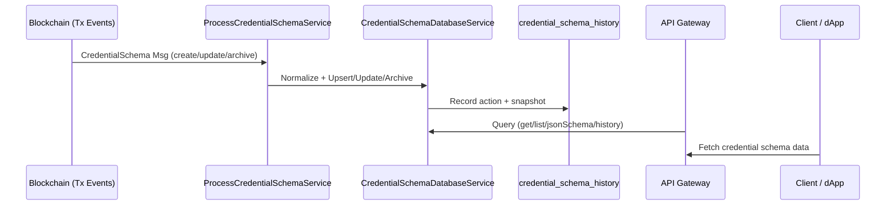

# 📘 Service: Credential Schema

## Overview

The **Credential Schema service** is responsible for **creating, updating, archiving, and retrieving credential schemas** in the Verana network.

It follows the **Verifiable Trust VPR spec** ([Credential Schema Messages](https://verana-labs.github.io/verifiable-trust-vpr-spec/#mod-cs-msg-1-create-new-credential-schema)) and ensures that schemas are properly **validated, versioned, stored, and exposed** through APIs.

Credential schemas define the **structure and validation rules** for credentials issued in the trust network.

---

## 🎯 Purpose

* **Index & Store** credential schema transactions from the blockchain.
* **Track lifecycle** (create, update, archive/unarchive) of credential schemas.
* **Maintain history** for auditability.
* **Expose APIs** for querying schemas.

---

## ⚙️ How It Works

### Workflow



### Components

1. **ProcessCredentialSchemaService**

   * Handles raw messages from the blockchain.
   * Calculates deposits (based on `module_params`).
   * Calls the database service with normalized payloads.

2. **CredentialSchemaDatabaseService**

   * Stores credential schemas in `credential_schemas`.
   * Tracks lifecycle events in `credential_schema_history`.
   * Provides query APIs (`get`, `list`, `JsonSchema`, `getHistory`, `getParams`).

---

## 🗄️ Database Schema

### Table: `credential_schemas`

| Column                                        | Type           | Description                        |
| --------------------------------------------- | -------------- | ---------------------------------- |
| `id`                                          | int            | Primary key                        |
| `tr_id`                                       | string         | Trust registry ID                  |
| `json_schema`                                 | jsonb          | The JSON schema definition         |
| `deposit`                                     | string         | Required deposit                   |
| `issuer_grantor_validation_validity_period`   | int            | Issuer → Grantor validity period   |
| `verifier_grantor_validation_validity_period` | int            | Verifier → Grantor validity period |
| `issuer_validation_validity_period`           | int            | Issuer validity period             |
| `verifier_validation_validity_period`         | int            | Verifier validity period           |
| `holder_validation_validity_period`           | int            | Holder validity period             |
| `issuer_perm_management_mode`                 | string            | Issuer permission mode             |
| `verifier_perm_management_mode`               | string            | Verifier permission mode           |
| `archived`                                    | timestamp/null | Archive flag (null = active)       |
| `is_active`                                    | boolean        | Schema is active or not            |
| `created`                                     | timestamp      | Created timestamp                  |
| `modified`                                    | timestamp      | Modified timestamp                 |

---

### Table: `credential_schema_history`

Keeps **full history of changes** to schemas.

| Column                 | Type           | Description                                |
| ---------------------- | -------------- | ------------------------------------------ |
| `credential_schema_id` | int            | FK → credential\_schemas.id                |
| `tr_id`                | string         | Trust registry ID                          |
| `json_schema`          | jsonb          | JSON schema snapshot                       |
| `deposit`              | string         | Deposit at time of change                  |
| `archived`             | timestamp/null | Archived state at time of change           |
| `is_active`             | boolean        | Active state at time of change             |
| `action`               | enum           | `create`, `update`, `archive`, `unarchive` |
| `changes`              | jsonb          | Field-level diffs                          |
| `created_at`           | timestamp      | When the change was recorded               |

---

## 🚀 API Actions

### 1. `upsert`

* Create a new credential schema.
* Records initial history entry.

### 2. `update`

* Update existing schema fields.
* Diffs changes and records them in history.

### 3. `archive` / `unarchive`

* Toggle schema archive state.
* Records action + diffs in history.

### 4. `get`

* Retrieve a single credential schema by `id`.

### 5. `list`

* List schemas with filters:

  * `tr_id`, `modified_after`, `only_active`, `issuer_perm_management_mode`, `verifier_perm_management_mode`.
* Supports pagination via `response_max_size`.

### 6. `JsonSchema`

* Retrieve only the **JSON schema definition** by `id`.

### 7. `getHistory`

* Retrieve full **lifecycle history** of a schema.

### 8. `getParams`

* Retrieve **module parameters** (from `module_params` table).
* Used for deposit calculation, trust unit pricing, etc.

---

## 🔑 Parameters

Defined in `module_params`:

* `credential_schema_trust_deposit`: Base deposit required for schema creation.
* `trust_unit_price`: Unit price multiplier from trust registry.
* **Effective deposit** = `credential_schema_trust_deposit × trust_unit_price`.

---

## 📦 Example: Create Credential Schema

```json
{
  "tr_id": "trust123",
  "id": 1,
  "json_schema": {
    "type": "object",
    "properties": {
      "firstName": { "type": "string" },
      "lastName": { "type": "string" }
    },
    "required": ["firstName", "lastName"]
  },
  "issuer_validation_validity_period": 3600,
  "verifier_validation_validity_period": 3600,
  "holder_validation_validity_period": 3600,
  "issuer_perm_management_mode": "OPEN",
  "verifier_perm_management_mode":"OPEN"
}
```

✅ Stored in `credential_schemas` and `credential_schema_history`.
✅ Deposit automatically applied from parameters.

---

## 🔍 References

* [Verana VPR Spec – Credential Schema](https://verana-labs.github.io/verifiable-trust-vpr-spec/#mod-cs-msg-1-create-new-credential-schema)
* `CredentialSchemaDatabaseService.ts`
* `ProcessCredentialSchemaService.ts`
