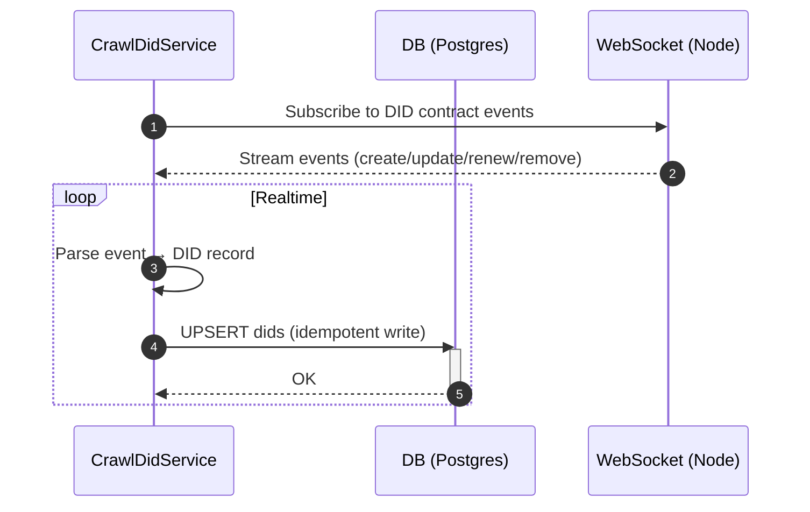

# Crawl DID

```mermaid
  sequenceDiagram
  autonumber
  participant A as CrawlDidService
  participant B as DB (Postgres)
  participant W as WebSocket (Node)

  A->>W: Subscribe to DID contract events
  activate W
  W-->>A: Stream events (create/update/renew/remove)

  loop Realtime
    A->>A: Parse event → DID record
    A->>B: UPSERT dids (idempotent write)
    activate B
    B-->>A: OK
    deactivate B
  end
```
