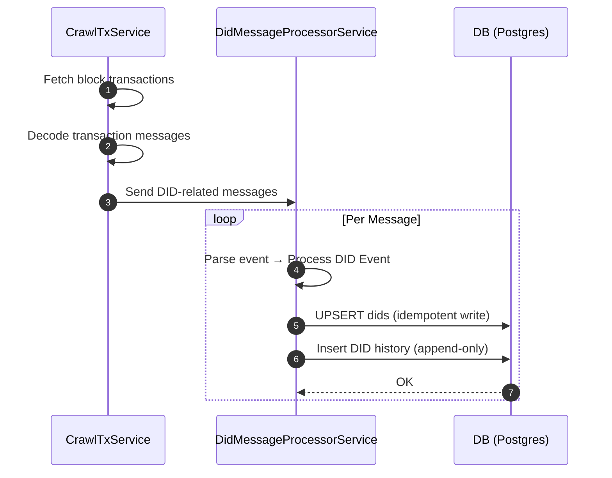

# Crawl DID

```mermaid
 sequenceDiagram
  autonumber
  participant C as CrawlTxService
  participant D as DidMessageProcessorService
  participant B as DB (Postgres)

  C->>C: Fetch block transactions
  C->>C: Decode transaction messages
  C->>D: Send DID-related messages

  loop Per Message
    D->>D: Parse event → Process DID Event
    D->>B: UPSERT dids (idempotent write)
    D->>B: Insert DID history (append-only)
    B-->>D: OK
  end


```
For details on how DID lifecycle changes are recorded and queried, see the  
👉 [DID History Service](./crawl-did-history.md)
