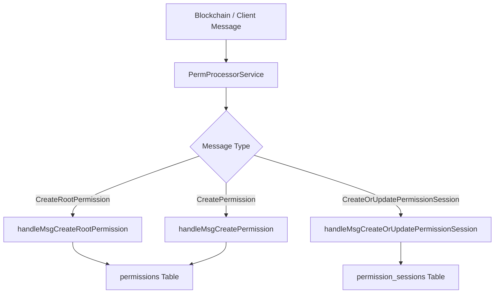
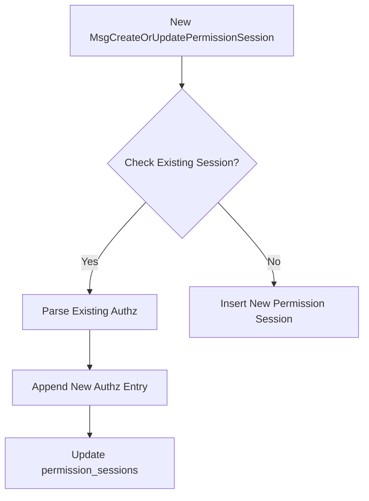
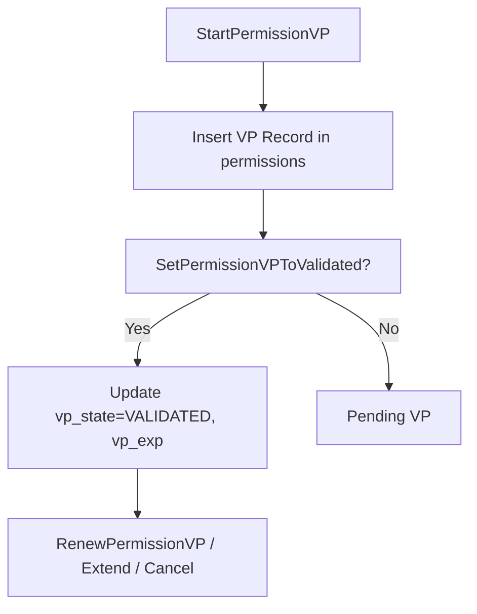

# Permission Services Documentation

This document describes the **Permission Processor Service** (`PermProcessorService`) and **Permission Ingest Service** (`PermIngestService`) used in the system. It explains how permission messages are handled, how data is saved and updated in the database, and the overall workflow.

---

## Table of Contents

1. [Overview](#overview)
2. [Services](#services)
   - [PermProcessorService](#permprocessorservice)
   - [PermIngestService](#permingestservice)
3. [Data Flow](#data-flow)
4. [Permission Sessions](#permission-sessions)
5. [Mermaid Diagrams](#mermaid-diagrams)
6. [Database Tables](#database-tables)
7. [Notes](#notes)

---

## Overview

The permission services are responsible for:

- Handling incoming **permission messages** from the blockchain.
- Creating, updating, and managing **permissions** and **permission sessions**.
- Validating, revoking, extending, or renewing permissions.
- Calculating fees and deposits based on global variables.
- Ensuring proper authorization and access control for all operations.

All database operations are performed using **Knex.js**, and transactions are used to ensure atomic updates.

---

## Services

### PermProcessorService

Acts as a **message processor** that receives messages from external sources (like blockchain events) and delegates them to the `PermIngestService`.

**Main Responsibilities:**

- Receives an array of `permissionMessages` via `handlePermissionMessages`.
- Maps message types to appropriate handlers in `PermIngestService`.
- Logs all received messages.
- Provides actions to **get** or **list permissions**.

**Message Handling Example:**

```ts

  switch (msg.type) {
        case PermissionMessageTypes.CreateRootPermission:
          await this.broker.call("permIngest.handleMsgCreateRootPermission", {
            data: payload,
          });
          break;
        case PermissionMessageTypes.CreatePermission:
          await this.broker.call("permIngest.handleMsgCreatePermission", {
            data: payload,
          });
          break;
        case PermissionMessageTypes.ExtendPermission:
          await this.broker.call("permIngest.handleMsgExtendPermission", {
            data: payload,
          });
          break;
        case PermissionMessageTypes.RevokePermission:
          await this.broker.call("permIngest.handleMsgRevokePermission", {
            data: payload,
          });
          break;
        case PermissionMessageTypes.StartPermissionVP:
          await this.broker.call("permIngest.handleMsgStartPermissionVP", {
            data: payload,
          });
          break;
        case PermissionMessageTypes.SetPermissionVPToValidated:
          await this.broker.call(
            "permIngest.handleMsgSetPermissionVPToValidated",
            { data: payload }
          );
          break;
        case PermissionMessageTypes.RenewPermissionVP:
          await this.broker.call("permIngest.handleMsgRenewPermissionVP", {
            data: payload,
          });
          break;
        case PermissionMessageTypes.CancelPermissionVPLastRequest:
          await this.broker.call(
            "permIngest.handleMsgCancelPermissionVPLastRequest",
            { data: payload }
          );
          break;
        case PermissionMessageTypes.CreateOrUpdatePermissionSession:
          await this.broker.call(
            "permIngest.handleMsgCreateOrUpdatePermissionSession",
            { data: payload }
          );
          break;
        case PermissionMessageTypes.SlashPermissionTrustDeposit:
          await this.broker.call(
            "permIngest.handleMsgSlashPermissionTrustDeposit",
            { data: payload }
          );
          break;
        case PermissionMessageTypes.RepayPermissionSlashedTrustDeposit:
          await this.broker.call(
            "permIngest.handleMsgRepayPermissionSlashedTrustDeposit",
            { data: payload }
          );
          break;
        default:
          break;
      }
````

---

### PermIngestService

Responsible for **directly interacting with the database** to manage permissions.

**Actions include:**

* `handleMsgCreateRootPermission`
* `handleMsgCreatePermission`
* `handleMsgExtendPermission`
* `handleMsgRevokePermission`
* `handleMsgStartPermissionVP`
* `handleMsgSetPermissionVPToValidated`
* `handleMsgRenewPermissionVP`
* `handleMsgCancelPermissionVPLastRequest`
* `handleMsgSlashPermissionTrustDeposit`
* `handleMsgRepayPermissionSlashedTrustDeposit`
* `handleMsgCreateOrUpdatePermissionSession`

**Key Points:**

* **Transactions** are used for creating/updating permission sessions and VPs to ensure atomicity.
* **Validation checks** are performed for required fields, type correctness, and authorization.
* Fee and deposit calculations rely on **global variables** (`trust_unit_price` and `trust_deposit_rate`).

---

## Data Flow

1. **Permission messages** arrive at `PermProcessorService`.
2. Messages are processed in `handlePermissionMessages`:

   * Each message type is routed to the appropriate handler in `PermIngestService`.
3. `PermIngestService` executes the database operations:

   * Checks for existing records.
   * Inserts new permissions or updates existing ones.
   * Updates `permission_sessions` with `authz` entries if needed.
4. Permissions are validated, renewed, or revoked, updating timestamps and state fields.

---

## Permission Sessions

**Permission sessions** track authorization between agents, issuers, and verifiers.

**Example JSON Stored in DB:**

```json
{
  "id": "123e4567-e89b-12d3-a456-426614174000",
  "controller": "verana1evvrzxw9yg5staqdvumd6fupy3jhaxfflla7st",
  "agent_perm_id": "17",
  "authz": [
    {
      "executor_perm_id": "17",
      "beneficiary_perm_id": "0",
      "wallet_agent_perm_id": "17"
    }
  ],
  "created": "2025-10-07T09:58:02.067837358Z",
  "modified": "2025-10-07T09:58:02.067837358Z"
}
```
```
* **`id`**: Session ID (UUID)
* **`controller`**: The account that controls this session
* **`agent_perm_id`**: Permission ID of the agent
* **`authz`**: Array of authorization entries
* **`created` / `modified`**: Timestamps

**Handling Updates:**

* If a session exists, new `authz` entries are appended.
* Otherwise, a new session row is created.

---

## Mermaid Diagrams

### 1. Permission Message Flow



### 2. Permission Session Update Flow



### 3. VP Lifecycle Flow



---

## Database Tables

### permissions

* `id` (BIGINT or UUID depending on migration)
* `schema_id`
* `type` (ECOSYSTEM, ISSUER, VERIFIER, HOLDER, etc.)
* `grantee`
* `validator_perm_id`
* `vp_state` (PENDING, VALIDATED, TERMINATED)
* `vp_current_fees`, `vp_current_deposit`
* `effective_from`, `effective_until`
* `modified`, `created`

### permission_sessions

* `id` (UUID)
* `controller`
* `agent_perm_id`
* `wallet_agent_perm_id`
* `authz` (JSON array)
* `created`, `modified`

---

## Notes

* `authz` entries store the authorization relationships for a session.
* All monetary values (fees, deposits) are stored as strings to avoid floating point errors.
* Global variables (`trust_unit_price` and `trust_deposit_rate`) are essential for fee and deposit calculations.
* UUIDs are used for session IDs, while permission IDs may be numeric (`BIGINT`) or string depending on migration.
* All actions are **idempotent**: repeated messages for the same session or permission do not create duplicates.

---

## Summary

The services together provide a **robust, blockchain-integrated permission management system**.

* **PermProcessorService**: Handles incoming messages and routes them.
* **PermIngestService**: Handles DB operations for creating, updating, validating, revoking, or extending permissions.
* **Permission sessions** track authorization among agents, issuers, and verifiers.
* **VPs** (Validation Processes) have their own lifecycle with fees and deposits.

