# 🏦 Trust Deposit Processor

This module provides **indexing**, **processing**, and **query APIs** for Trust Deposit state on the blockchain.  
It listens to **on-chain events**, **transaction messages**, and **slash actions** — then maintains a **real-time database view** for querying trust deposit balances and stats.

---

## 🧭 Architecture Overview

```mermaid
flowchart LR
  A[⛓ Blockchain Events] --> B[CrawlTrustDepositService]
  B -->|Adjust events| C[TrustDeposit Table]
  D[🔔 Msg Reclaim / Slash / Repay] --> E[TrustDepositMessageProcessorService]
  E -->|Updates| C
  F[📡 API Requests] --> G[TrustDepositDatabaseService]
  G -->|Read Queries| C
```



## 🧱 Database Schema

### `trust_deposits`

| Column            | Type      | Description                                           |
| ----------------- | --------- | ----------------------------------------------------- |
| `id`              | UUID / PK | Table's identity                                      |
| `account`         | string    | Account address associated with this trust deposit    |
| `share`           | string    | Total share amount currently held by this account     |
| `amount`          | string    | Total trust deposit amount                            |
| `claimable`       | string    | Amount that can currently be claimed by the account   |
| `slashed_deposit` | string    | Total amount slashed from this trust deposit          |
| `repaid_deposit`  | string    | Total amount repaid to this trust deposit after slash |
| `last_slashed`    | datetime  | Timestamp of the last slashing event                  |
| `last_repaid`     | datetime  | Timestamp of the last repayment event                 |
| `slash_count`     | integer   | Total number of slashing events                       |
| `last_repaid_by`  | string    | Account that repaid the last slashed amount           |

📝 **Notes**

- Amounts are stored as strings (to avoid precision loss on large values).
- Available balance = `amount - slashed_deposit + repaid_deposit`.

---

## 🕵️ 1. CrawlTrustDepositService

**Path:** `src/services/crawl-td/td_adjust.service.ts`
**Responsibility:**
Continuously crawls blocks and extracts **`adjust_trust_deposit`** events from transaction responses.
When found, updates `trust_deposits` table accordingly.

### Key Features

- Tracks `BlockCheckpoint` to resume crawling from the last processed block.
- Reads transaction events and filters for `adjust_trust_deposit`.
- Updates `amount`, `share`, `claimable`, `slashed_deposit`, `repaid_deposit`, and `slash_count`.
- Handles slashing and repayment adjustments automatically.


---

## 📨 2. TrustDepositMessageProcessorService

**Path:** `src/services/crawl-td/td_processor.service.ts`
**Responsibility:**
Processes **application-level messages** related to trust deposits such as reclaiming yield, reclaiming deposits, and repaying slashed amounts.

### Handled Message Types

| Message Type                       | Action Description                                                    |
| ---------------------------------- | --------------------------------------------------------------------- |
| `RECLAIM_YIELD`                    | Decreases shares and releases claimable yield                         |
| `RECLAIM_DEPOSIT`                  | Burns a portion if applicable and decreases deposit amount            |
| `REPAY_SLASHED`                    | Increases deposit + share to repay previously slashed amount          |
| `SLASH_TRUST_DEPOSIT` _(internal)_ | Deducts deposit and increases slashed_deposit, increments slash_count |

### Internal Logic

- Uses `ModuleParams` for `trust_deposit_share_value` and burn rates.
- Calculates burn amount on reclaim.
- Validates slashing rules and repayment rules.
- Ensures data consistency using DB transactions.


---

## 📡 3. TrustDepositDatabaseService

**Path:** `src/services/crawl-td/td_database.service.ts`
**Responsibility:**
Exposes API actions to **query** trust deposit data from the database.

### Actions

| Action Name         | Description                             | Params                                                   |
| ------------------- | --------------------------------------- | -------------------------------------------------------- |
| `getTrustDeposit`   | Returns a single trust deposit record   | `account` (string, required)                             |
| `listTrustDeposits` | Returns paginated deposits with filters | `min_amount`, `min_share`, `has_claimable`, `is_slashed` |

### Example Response: `getTrustDeposit`

```json
{
  "trust_deposit": {
    "account": "verana1xxx...",
    "share": "12000",
    "amount": "500000000",
    "claimable": "20000",
    "slashed_deposit": "10000",
    "repaid_deposit": "0",
    "last_slashed": "2025-10-09T12:34:56Z",
    "last_repaid": null,
    "slash_count": 1,
    "last_repaid_by": null
  }
}
```

### Example Response: `getTrustDepositStats`

```json
{
  "total_accounts": 1284,
  "total_amount": "4500000000",
  "total_share": "231000",
  "total_claimable": "122000",
  "total_slashed": "120000",
  "total_repaid": "110000",
  "total_slash_events": 88
}
```

---

## 🧭 Entity Relationship Diagram (ERD)


