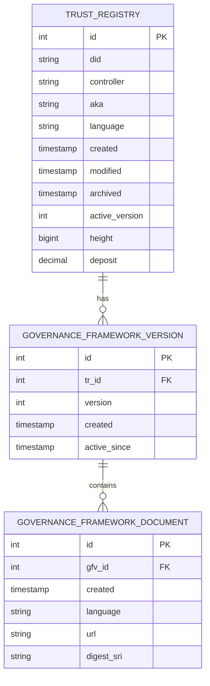
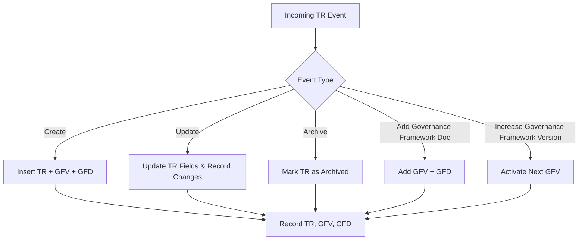

# 🏛️ Trust Registry Module

This guide provides a complete overview of the **Trust Registry (TR)** module, including **data models**, **relationships**, **event processing flow**, and **audit/history tracking**.

---

## 📌 Overview

The **Trust Registry module** is responsible for managing:

1. **Trust Registries (TR)** – Core registry entities identified by DID, controlled by a creator, and containing deposits, language preferences, and versioning.
2. **Governance Framework Versions (GFV)** – Versioned governance frameworks linked to TR.
3. **Governance Framework Documents (GFD)** – Documents under each GFV, representing legal, technical, or operational frameworks.

This module ensures **auditability** by recording all TR, GFV, and GFD messages in history tables.

---

## 📊 Data Models & Relationships

---

## ⚡ Event Processing Flow

---

## ⚙️ Event Types & Description

| Event Type                             | Description                                     |
| -------------------------------------- | ----------------------------------------------- |
| **Create / CreateLegacy**              | Create TR along with initial GFV and GFD.       |
| **Update**                             | Update TR fields (DID, AKA, language, deposit). |
| **Archive**                            | Mark TR as archived in the system.              |
| **AddGovernanceFrameworkDoc**          | Add a new GFV and associated GFD(s).            |
| **IncreaseGovernanceFrameworkVersion** | Activate the next version of GFV for the TR.    |

---

## 📜 History & Audit Reference

All changes to TR, GFV, and GFD entities are recorded in **history tables** for auditability and traceability.
You can view the **complete Trust Registry History module** here:

[📖 Trust Registry History Module – Developer Guide](./crawl-tr-history.md)

This link provides **visual ER diagrams, change tracking flows, and architecture overviews** for historical data.
