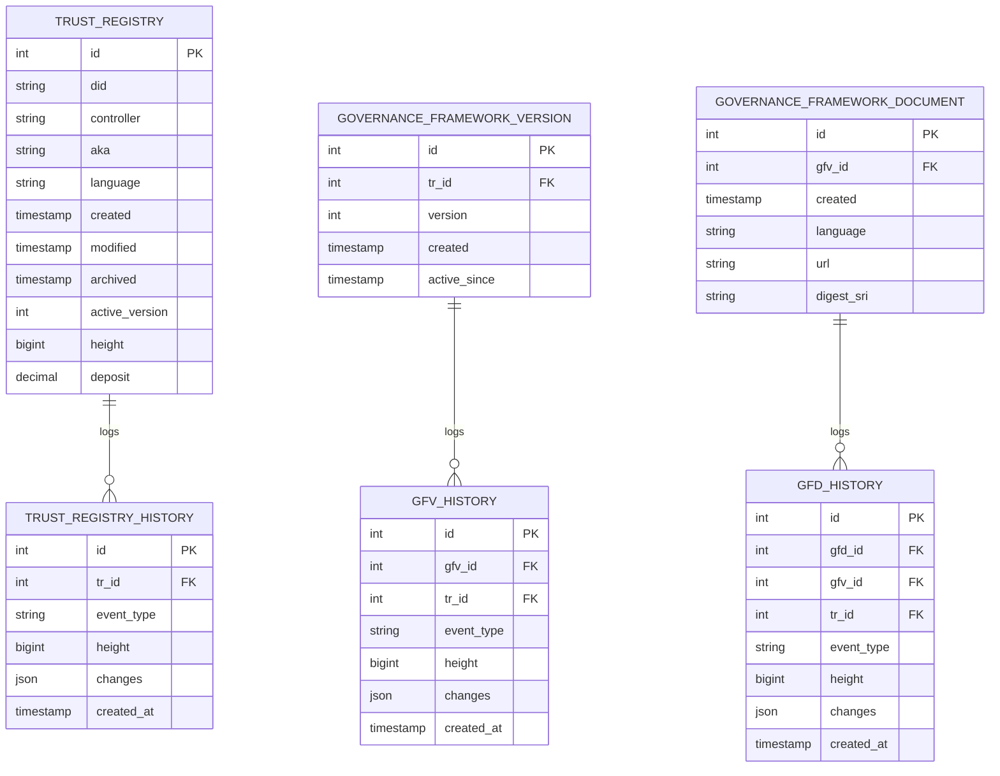
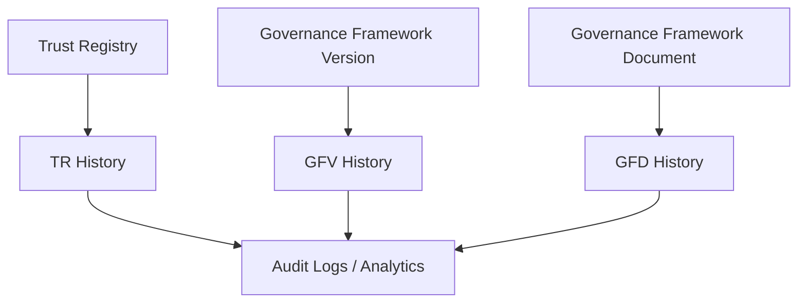
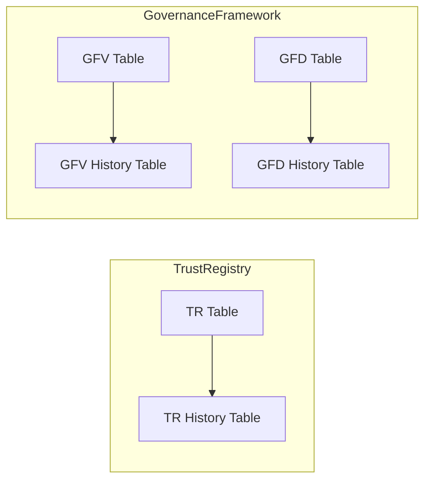

# Trust Registry History Module – Developer Guide

This document provides a complete **visual overview** of the Trust Registry History module, including all data models, relationships, and change tracking flows.

---

## 📌 Overview

The system tracks changes for auditability:

1. **TR History** – Tracks Trust Registry creation, updates, and archival.
2. **GFV History** – Tracks Governance Framework Version changes.
3. **GFD History** – Tracks Governance Framework Document additions and updates.

---

## 📊 Data Models & Relationships

---

## 🔄 Change Tracking Flow

---

## 🌐 Module Architecture Overview

